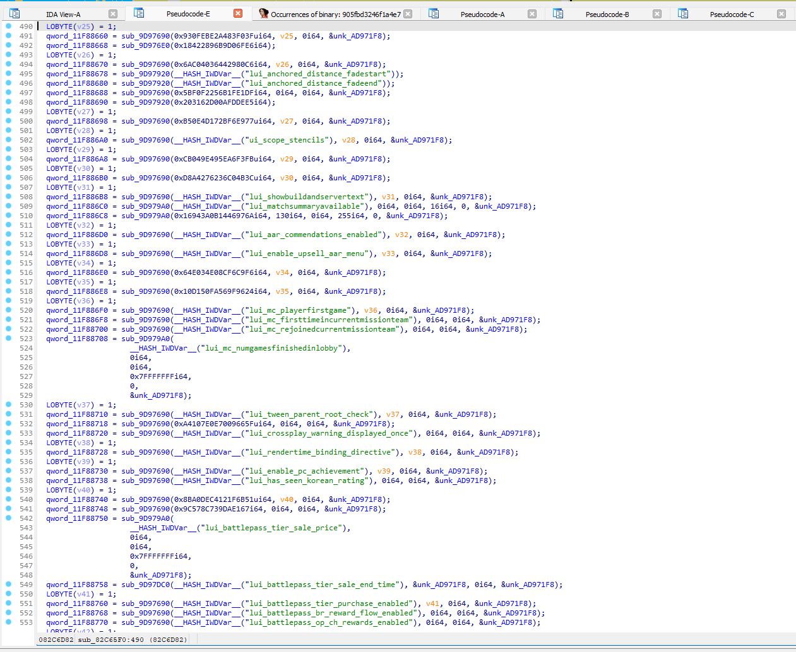

# Ida Hash Plugin

## How to use

Download the latest release dll for your IDA version:

- [IDA 7 x64](https://github.com/ate47/ida_hash_plugin/releases/latest/download/ida_hash_plugin64.dll)
- [IDA 9](https://github.com/ate47/ida_hash_plugin/releases/latest/download/ida_hash_plugin.dll)

Copy the release DLL in your `ida/plugins` directory.

Now create in the `ida/cfg` directory a file named `hash_strings.txt`. This file contains all the strings used by the plugin (one string per line).

For now these hash functions are registered, see [hash_mini.hpp](src/plugin/hash_mini.hpp) for their implementations and [ate47/HashIndex](https://github.com/ate47/HashIndex/blob/main/docs/hashes.md) for their usages.

- `__HASH_64__`
- `__HASH_32__`
- `__HASH_IWDVar__`
- `__HASH_IWAsset__`
- `__HASH_JupScr__`
- `__HASH_T10OmnVar__`
- `__HASH_T10Scr__`
- `__HASH_T10ScrSP__`
- `__HASH_T89Scr__`
- `__HASH_T7__`
